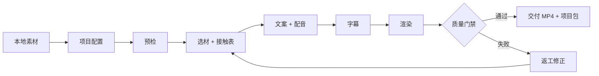

<div align="center">

# local-short-video

把本地图片和视频变成可验证、可复用、可交付的短视频项目。

[](skills/local-short-video/SKILL.md)
[](#核心原则)
[](#流水线)
[](LICENSE)

<sub>Local assets · TTS voiceover · Subtitle QA · Asset ledger · Mobile MP4</sub>

</div>

---

## 它解决什么

`local-short-video` 是一个通用 Codex Skill，用来把用户自己的本地素材整理成短视频项目。它不绑定品牌、行业、语言、盘符或目录结构，适合商品展示、门店宣传、活动预告、教程、服务介绍和内容剪辑。

它关心的不只是“导出一个 MP4”，而是把生产过程拆成可检查的步骤：选材有来源，文案有依据，配音有真实时间轴，字幕和口播一致，最终视频适合手机播放。



## 核心原则

| 原则 | 做法 |
| --- | --- |
| 本地优先 | 默认只使用用户本地素材；外部素材或生成内容需要明确许可 |
| 可见事实 | 文案只写画面支持或用户明确提供的内容 |
| 配音可信 | TTS 音频和字幕时间轴同时生成，不凭感觉估字幕 |
| 字幕一致 | 字幕保留口播原文，只允许换行和分段 |
| 手机兼容 | 最终导出 H.264、`yuv420p`、AAC LC stereo、fast start MP4 |
| 可追踪 | 只把真正进入成片的素材写入使用台账 |

## 快速安装

```bash
git clone https://github.com/cresc0223-ux/copilot-skills.git
cd copilot-skills
```

Windows:

```powershell
powershell -ExecutionPolicy Bypass -File .\install.ps1
```

macOS / Linux:

```bash
sh ./install.sh
```

安装到自定义目录：

```powershell
.\install.ps1 -Destination "D:\Codex\skills\local-short-video"
```

安装 TTS 依赖 `edge-tts`：

```powershell
.\install.ps1 -InstallDependencies
```

安装后重新加载 Codex，然后在对话里调用 `$local-short-video`。

## 快速使用

把工作区、素材区和视频目标告诉 Codex 即可：

```text
请使用 $local-short-video。
工作区：D:/VideoWorkspace
素材区：D:/VideoMaterials
制作一支 30 秒竖屏商品展示视频，使用西班牙语口播。
源素材静音，不添加背景音乐。
```

Codex 会创建项目目录，完成预检、选材、接触表、脚本、配音、字幕、渲染、验证和素材台账更新。

## 流水线

| 阶段 | 主要脚本 | 产物 |
| --- | --- | --- |
| 创建项目 | `create_project.py` | `project_config.json`、`process.md` |
| 环境预检 | `preflight_local_video.py` / `.ps1` | `preflight_report.json` |
| 素材选择 | `select_assets.py` | `selected_assets.json`、CSV |
| 视觉预览 | `create_contact_sheet.py` | `preview_assets_contact_sheet.jpg` |
| 配音生成 | `synthesize_voice.py` | `voice.mp3`、`voice.vtt` |
| 字幕整理 | `normalize_subtitles.py`、`create_pop_ass.py` | `captions.srt`、`captions.ass` |
| 视频渲染 | `render_local_video.py` | `final_*_mobile.mp4`、`used_assets.json` |
| 成片验证 | `validate_final.py` | `validation_report.json` |
| 台账更新 | `update_asset_usage.py` | asset usage ledger |

## 产物地图

```text
project/
├── project_config.json
├── process.md
├── selected_assets.json
├── preview_assets_contact_sheet.jpg
├── script_source.txt
├── script_review.txt
├── voice.mp3
├── voice.vtt
├── captions.srt
├── captions.ass
├── used_assets.json
├── validation_report.json
└── final_topic_mobile.mp4
```

## 仓库结构

```text
copilot-skills/
├── README.md
├── LICENSE
├── VERSION
├── requirements.txt
├── install.ps1
├── install.sh
├── tools/
│   └── validate_package.py
└── skills/
    └── local-short-video/
        ├── SKILL.md
        ├── agents/openai.yaml
        ├── references/
        └── scripts/
```

## 质量门禁

最终交付前至少检查这些项目：

| 检查项 | 合格条件 |
| --- | --- |
| 画面 | 目标分辨率、目标帧率、非空帧 |
| 音频 | AAC LC stereo、音量正常、非静音 |
| 字幕 | SRT 与源语言脚本全文一致，ASS 位于安全区 |
| 编码 | H.264、`yuv420p`、fast start MP4 |
| 素材 | 使用记录只包含实际进入成片的文件 |
| 过程 | `process.md` 记录关键选择、失败和修复 |

## 不适合做什么

- 不伪造商品、价格、地址、库存、质量或活动信息。
- 不用随机镜头替代指定门头、人物、招牌或产品露出。
- 不在配音失败时交付静音视频并声称已完成。
- 不把审阅翻译直接当作口播脚本。
- 不把含隐私或未授权媒体的素材上传到公开仓库。

## 隐私和许可证

素材默认保留在本地。使用 `edge-tts` 生成配音时，最终口播文本会发送到 Microsoft 语音服务；请先确认你的网络和隐私要求。

本仓库采用 MIT License，详见 [LICENSE](LICENSE)。
